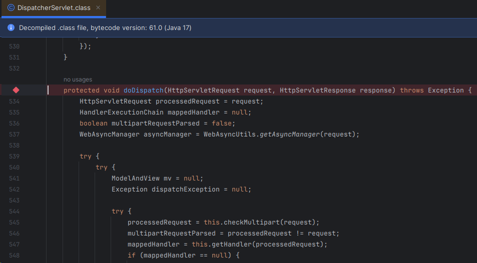
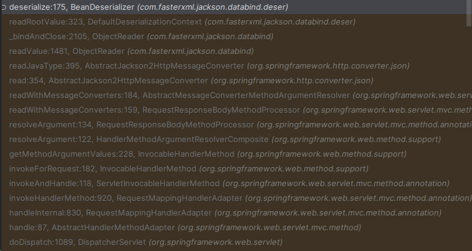
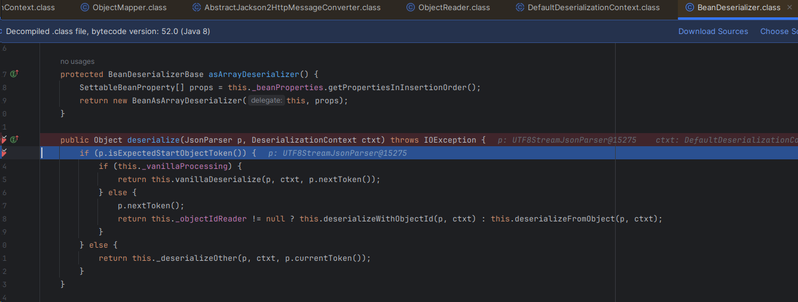
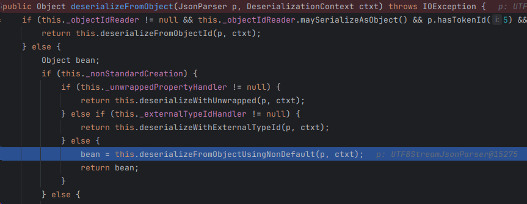
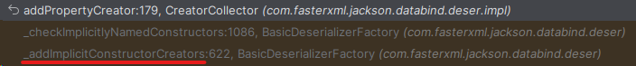

# 문제 상황
> JSON parse error: Cannot construct instance of `~~Dto` (although at least one Creator exists): cannot deserialize 
> from Object value (no delegate- or property-based Creator).
{: .prompt-danger }

스프링부트로 웹 개발을 하다보면 만날 수 있는 흔한 에러다.
보통 controller의 인자로 @RequestBody annotation을 받을 때 자주 발생한다.

에러가 발생한 원인은 역직렬화 과정에서 dto 객체에 값을 할당할 수 없기 때문에 일어난다.

## 해결 방법
이 에러를 해결할 수 있는 방법은 다양하다. 다음의 방법으로 간단하게 해결할 수 있다.
1. 기본생성자 생성
2. @JsonCreator 등 annotation 사용

우리 팀은 기본생성자를 DTO마다 생성해 주는 방식으로 이 에러를 해결하고자 하였다.

기본생성자를 적용해주며 발견한 새로운 문제가 있었는데 
어떤 DTO 객체는 역직렬화 과정에서 기본생성자가 없을 때 위와 같은 에러가 발생한 반면
어떤 DTO 객체는 기본생성자가 없어도 에러가 발생하지 않는 현상이 있었다. 


1. 기본생성자가 없을 때 에러가 발생하지 않는 DTO (이하 1번 DTO)
```java
@Getter
public class LoginRequestDto {
	private final String email;

	private final String password;

	@Builder
	public LoginRequestDto(String email, String password) {
		this.email = email;
		this.password = password;
	}
}
```

2. 기본생성자가 없을 때 에러가 발생하는 DTO (이하 2번 DTO)
```java
@Getter
public class ChargePointRequestDto {
	private final Long pointForCharge;

	@Builder
	public ChargePointRequestDto(Long pointForCharge) {
		this.pointForCharge = pointForCharge;
	}
}
```

어떠한 이유 때문에 이런 차이가 발생하는지 파헤치는 것이 포스팅을 쓰게 된 이유이다.
다음은 본격적으로 원인을 분석해보자.

# 문제 분석
실행흐름을 따라가며 **RequestBody**로 넘어오는 위의 두 값이 역직렬화 시점에  어떤 차이를 보이는지 확인을 통해서 문제의 원인을 분석하고자 한다.   
코드를 따라가며 변수명만 보고 어떤 코드인지 추측해야하기 때문에 가정을 세우고 이를 검증하는 과정을 거치며 문제의 원인을 분석하였다.



`DispatcherServlet`에서 시작하여 실행흐름을 따라가며 역직렬이 일어나는 시점을 찾아보자.




위의 사진은 지나온 실행흐름의 순서이다. 


실행흐름을 잘 따라오면 이곳까지 도달할 수 있을 것이다.  
`vanillaProcessing`이라는 변수명이 기본생성자와 관련이 있을 것만 같다. 

## 가정 1. 기본생성자가 있으면 vanillaProcessing의 값이 true인가?

검증 결과 있든 없든 모두 false.

그렇다면 조금 더 실행 흐름을 진행시켜 보자.



`nonStandardCreation`과 기본생성자가 관련이 있을 것만 같다.

## 가정 2. 기본생성자가 있을 때 nonStandardCreation이 false가 되는가?
확인 결과 기본생성자가 없으면 **true**가 되고 있으면 **false**가 된다. 
기본생성자의 유무 차이에 따라 이곳에서 분기가 나뉘는 것을 확인하였다. 

`_unwrappedPropertyHandler`과 `_externalTypeIdHandler` 모두 null이기 때문에 `deserializeFromObjectUsingNonDefault`로 실행흐름이 넘어간다.


```java
protected Object deserializeFromObjectUsingNonDefault(JsonParser p, DeserializationContext ctxt) throws IOException {
      JsonDeserializer<Object> delegateDeser = this._delegateDeserializer();
      if (delegateDeser != null) {
          Object bean = this._valueInstantiator.createUsingDelegate(ctxt, delegateDeser.deserialize(p, ctxt));
          if (this._injectables != null) {
              this.injectValues(ctxt, bean);
          }

          return bean;
      } else if (this._propertyBasedCreator != null) {
          return this._deserializeUsingPropertyBased(p, ctxt);
      } else {
          Class<?> raw = this._beanType.getRawClass();
          if (ClassUtil.isNonStaticInnerClass(raw)) {
              return ctxt.handleMissingInstantiator(raw, (ValueInstantiator)null, p, "non-static inner classes like this can only by instantiated using default, no-argument constructor", new Object[0]);
          } else {
              return NativeImageUtil.needsReflectionConfiguration(raw) ? ctxt.handleMissingInstantiator(raw, (ValueInstantiator)null, p, "cannot deserialize from Object value (no delegate- or property-based Creator): this appears to be a native image, in which case you may need to configure reflection for the class that is to be deserialized", new Object[0]) : ctxt.handleMissingInstantiator(raw, this.getValueInstantiator(), p, "cannot deserialize from Object value (no delegate- or property-based Creator)", new Object[0]);
          }
      }
  }
```
처음 목격했던 에러 메시지를 여기서 반환하는 것을 알 수가 있다. 제대로 찾아온 듯하다.

1번 DTO가 에러를 반환하지 않는 다는 것은 위 코드에서 if 조건중 하나에 부합한다는 의미이고 
2번 DTO가 에러를 반환한다는 것은 조건에 부합하지 않아 else에 걸린 것이다. 

확인 결과 1번 DTO는 `propertyBasedCreator`가 null이 아니라 if 조건에 부합해 제대로 역직렬화 되어 반환된다. 

그렇다면 어떤 이유 때문에 1번 DTO는 `propertyBasedCreator`가 null이 아니고 2번 DTO는 null인 걸까?
참고로 `propertyBasedCreator`는 @JsonCreator annotation을 사용했을 때 초기화되는 필드이다.

`propertyBasedCreator`으로 1번과 2번의 차이를 알게 되었으니 이 필드에 값이 초기화되는 시점을 쫓으면 원인을 파악할 수 있을 것이다.


```java
// BeanDeserializeBase.class
public void resolve(DeserializationContext ctxt) throws JsonMappingException {
  ExternalTypeHandler.Builder extTypes = null;
  SettableBeanProperty[] creatorProps;

  if (this._valueInstantiator.canCreateFromObjectWith()) {
    creatorProps = this._valueInstantiator.getFromObjectArguments(ctxt.getConfig());
    if (this._ignorableProps != null || this._includableProps != null) {
      int i = 0;

      for(int end = creatorProps.length; i < end; ++i) {
        origProp = creatorProps[i];
        if (IgnorePropertiesUtil.shouldIgnore(origProp.getName(), this._ignorableProps, this._includableProps)) {
          creatorProps[i].markAsIgnorable();
        }
      }
    }
  } else {
    creatorProps = null;
  }
  
  // ...

  if (creatorProps != null) {
    this._propertyBasedCreator = PropertyBasedCreator.construct(ctxt, this._valueInstantiator, creatorProps,
      this._beanProperties);
  }

  // ...
}
```

다시 처음으로 돌아가서 실행흐름을 따라가면 위의 코드에서 `creatorProps`가 null이 아닐 때 초기화되는 것을 알 수 있다. 

그렇다면 `creatorProps`는 무엇이고 언제 초기화 되는가?
`creatorProps`가 초기화되는 지점을 따라가보자.

코드를 조금 올라가보면 `candCreateFromObjectWith()`가 true일 때 `creatorProps`에 값이 채워진다. 

```java
// StdValueInstantiator.class

public boolean canCreateFromObjectWith() {
    return this._withArgsCreator != null;
}
```
`candCreateFromObjectWith()`는 `_withArgsCreator`가 null이 아닐 때 true가 된다.

그렇다면 `_withArgsCreator`가 초기화 되는 시점은 언제인가?

```java
// CreatorCollector.class
public ValueInstantiator constructValueInstantiator(DeserializationContext ctxt) throws JsonMappingException {
    // ...
  
    inst.configureFromObjectSettings(this._creators[0], this._creators[8], delegateType, this._delegateArgs, this._creators[9], this._propertyBasedArgs);
  
    // ...
    return inst;
}
```
`configureFromObjectSettings`를 호출하면서 `_withArgsCreator`가 초기화된다. 
참고로 index 9가 `propertyBasedCreator`를 의미한다.

```java
public void addPropertyCreator(AnnotatedWithParams creator, boolean explicit, SettableBeanProperty[] properties) {
    if (this.verifyNonDup(creator, 9, explicit)) {
        if (properties.length > 1) {
            HashMap<String, Integer> names = new HashMap();
            int i = 0;

            for(int len = properties.length; i < len; ++i) {
                String name = properties[i].getName();
                if (!name.isEmpty() || properties[i].getInjectableValueId() == null) {
                    Integer old = (Integer)names.put(name, i);
                    if (old != null) {
                        throw new IllegalArgumentException(String.format("Duplicate creator property \"%s\" (index %s vs %d) for type %s ", name, old, i, ClassUtil.nameOf(this._beanDesc.getBeanClass())));
                    }
                }
            }
        }

        this._propertyBasedArgs = properties;
    }
}
```

9번 index에 값을 넣어주는 부분이다. 



이 함수를 호출하는 곳을 거슬러 올라가 보면 이곳에 도달할 수 있다.


```java
// BasicDeserializeFactory.class
protected void _addImplicitConstructorCreators(DeserializationContext ctxt, CreatorCollectionState ccState, List<CreatorCandidate> ctorCandidates) throws JsonMappingException {
  // ...
  
  List<AnnotatedWithParams> implicitCtors = null;

  // ...
  
  while(true) {
    // ...
    do {
      while(true) {
        while(var11.hasNext()) {
          candidate = (CreatorCandidate)var11.next();
          int argCount = candidate.paramCount();
          ctor = candidate.creator();
          if (argCount == 1) {
            // ...
          } else {
            // ...
            if (!creators.hasDefaultCreator()) {
              if (implicitCtors == null) {
                implicitCtors = new LinkedList();
              }

              implicitCtors.add(ctor);
            }
          }
        }

        if (implicitCtors != null && !creators.hasDelegatingCreator() && !creators.hasPropertyBasedCreator()) {
          this._checkImplicitlyNamedConstructors(ctxt, beanDesc, vchecker, intr, creators, implicitCtors);
        }

        return;
      }
    } while(name == null && injection == null);
    
    // ...
  }
}
```

이 코드에서 1번 DTO와 2번 DTO의 차이를 알 수 있다.  
위 코드 10번 라인을 보면 `argCount`에 따라서 분기가 나뉘는 것을 확인할 수 있다.  
`argCount`는 DTO의 필드 개수를 의미한다.  
즉, 필드 개수가 1개일 때는 if 조건을 만족하고 필드 개수가 2개 이상이면 조건을 만족하지 않기 때문에 else로 넘어간다.
else 블록에서 `implicitCtors`가 초기화되고 값이 추가가 된다.

```java
if (implicitCtors != null && !creators.hasDelegatingCreator() && !creators.hasPropertyBasedCreator()) {
  this._checkImplicitlyNamedConstructors(ctxt, beanDesc, vchecker, intr, creators, implicitCtors);
}
```

따라서 위 조건을 만족하게 되고 `_checkImplicitlyNamedConstructors`가 호출된다.  
이 함수 내부에서 지금까지 살펴봤던 부분들이 연쇄적으로 호출되면서 최종적으로 `PropertyBasedCreator`가 null이 아니게 되어 역직렬화가 가능해진다.   

# 결론
필드의 개수가 1개인 DTO는 기본생성자가 없으면 역직렬화가 안 되고   
필드의 개수가 2개 이상인 DTO는 기본생성자가 없어도 역직렬화가 가능하다.

따라서 기본생성자가 없을 때  
1번 DTO는 필드의 개수가 2개이므로 역직렬화가 가능하고   
2번 DTO는 필드의 개수가 1개이므로 불가능하다.

필드 개수를 인지하면서 기본생성자를 붙일지 말지 결정하기 보다는   
항상 기본생성자를 생성하도록 팀 기본 룰로 정하는 것이 실수할 가능성을 줄이는 것이라 생각된다.

ps. 아쉬운 점은 어떤 이유에 의해서 이런 식으로 구현하였는지 알 수 없다는 점이다. 
