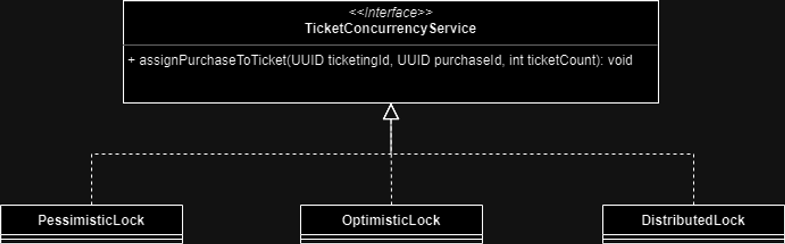
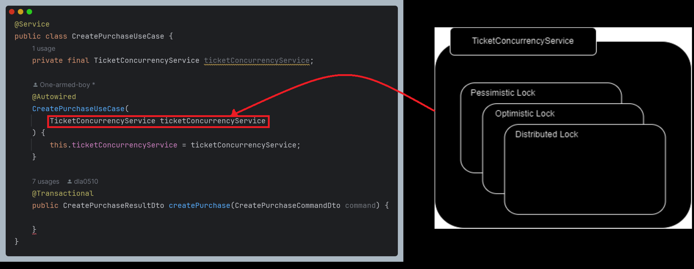
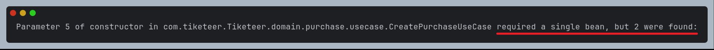
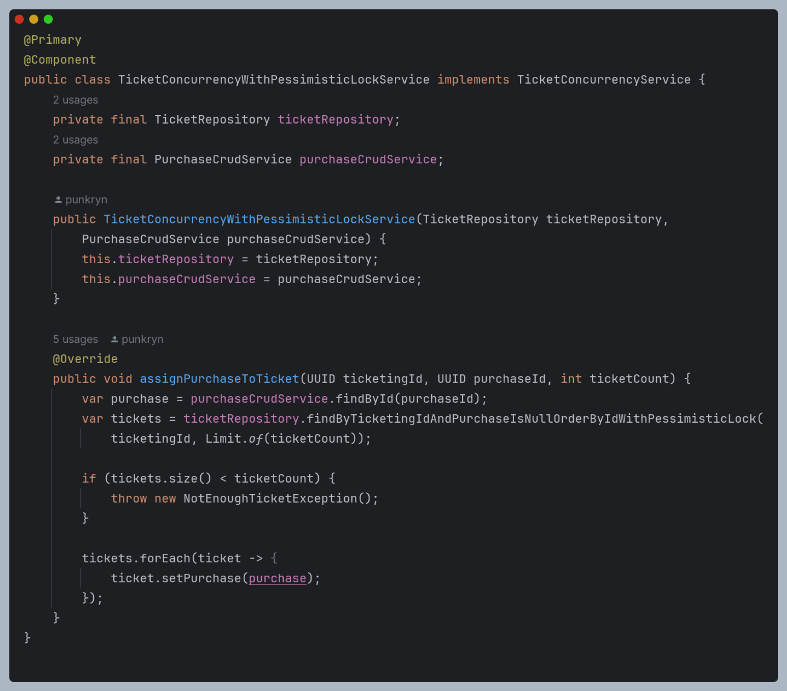
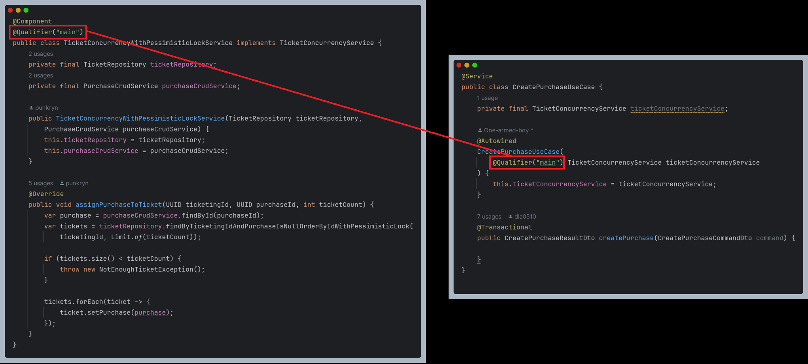
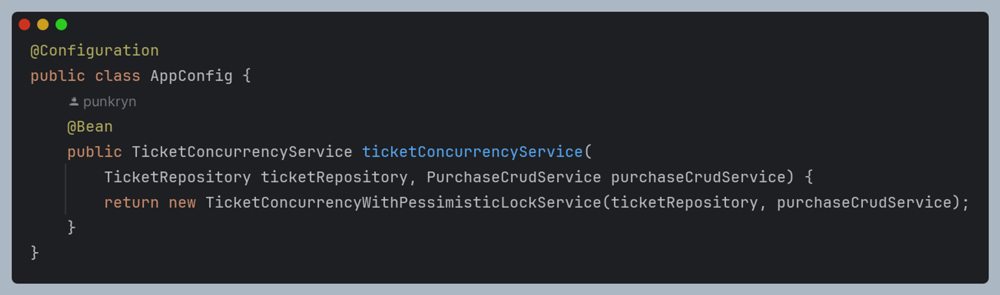
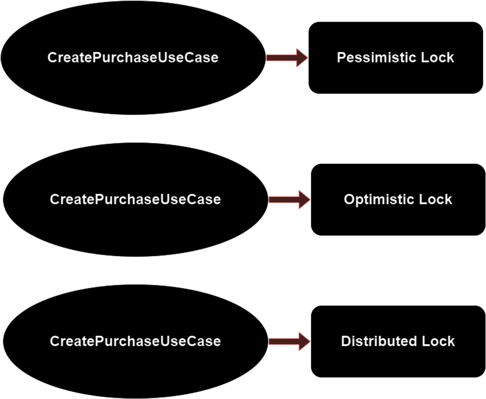
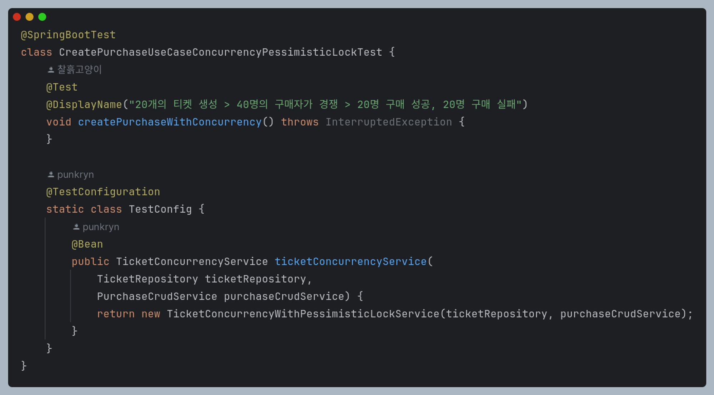
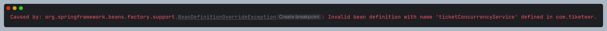

# 서론

## 개요

현재 우리 [프로젝트](https://github.com/Tiketeer)의 핵심 목표인 티켓 구매에 대한 동시성 문제를 해결하기 위해 락을 도입하기로 결정하였다. 여러 가지 락의 종류 중 **비관적 락**, **낙관적 락**, **분산 락**을 후보로 
선정하였다.

(티켓 구매에 대한 동시성 문제를 다룬 글은 [여기](https://www.notion.so/27167ab086ac49b482e9e25a58dd3f79?pvs=21)에서 볼 수 있다.)

후보로 선정된 락 중 우리 서비스에 가장 적절한 락은 어떤 것일지 분석할 필요가 생겼다. 따라서 락을 추상화한 인터페이스를 정의하고 각각의 락이 인터페이스의 구현체로 유즈케이스 내에 사용되도록 하여 성능을 비교해보기로 하였다.


위의 이미지와 같은 구조를 가지게 된다. 

## 문제 원인

위 서비스를 사용하는 티켓 구매 유즈케이스에서는 `TicketConcurrencyService`를 바라 보고 있다. 그렇다면 스프링 컨테이너 입장에서는 의존성 주입 시점에 동일한 타입의 빈 중 어떤 것을 선택해야 할지 알 수가 없다.

또한 테스트에서는 세 가지 락을 각각 적용한 유즈케이스에 대한 테스트가 모두 작성되기를 원한다. 따라서 하나의 유즈케이스에 대해 비관적 락을 적용한 테스트, 낙관적 락을 적용한 테스트, 분산 락을 적용한 테스트 모두를 작성해야 한다.

# 본론

## 원인 분석

### 컴포넌트 스캔

스프링은 컴포넌트 스캔을 통해 `@Component` annotation이 붙은 모든 클래스를 스프링 빈으로 등록한다. `@Autowired` annotation을 지정하면 스프링 컨테이너가 자동으로 타입이 같은 스프링 빈을 찾아서 주입한다.


이 과정에서 타입이 같은 빈이 여러 개 있고 선택 기준이 없다면 스프링에서 다음의 에러가 발생한다. 


### 테스트

모종의 해결 방법으로 후보 빈 중 하나를 잘 주입해주었다 하더라도 세 가지 락을 각각 적용한 유즈케이스에 대한 테스트를 모두 작성할 수 없다.

예를 들어 비관적 락을 적용한 빈을 주입하기로 결정했다면 그 외의 락들에 대해서는 주입해주고 있지 않기 때문에 여전히 테스트를 작성할 수 없다.

따라서 테스트 시점에 다른 빈을 주입할 수 있어야 한다.


## 해결 방안

동일한 타입의 빈이 여럿 있을 때 의존성 주입하는 방법은 몇 가지 존재한다. 그 중 후보로 꼽은 방법은 다음과 같다.

1. `@Primary`
2. `@Qualifier`
3. 수동 빈 생성

어떤 기준으로 이 후보들 중 하나를 선택했는지 소개하고자 한다.

### @Primary

위 코드처럼 빈으로 주입하고자 하는 컴포넌트에 `@Primary` annotation을 붙여주는 방식이다.

이 방식을 적용하면 스프링 컨테이너에서 의존성 주입할 때 이 빈을 자동으로 넣어준다.

주입할 빈에 붙여주기만 하면 되기 때문에 가장 손 쉬운 방법이라 생각한다.

다만 어떤 컴포넌트를 선택할지에 대한 책임이 코드 곳곳에 흩뿌려지는 단점이 있다.

### @Qualifier

위 코드처럼 주입할 빈의 이름을 정해 이름을 통해 어떤 빈을 주입할지 찾는 방식이다.

주입할 빈이 변경이 되면 `@Primary` annotation과는 반대로 사용되는 곳에서 이를 수정해야 한다.

만약 사용되는 컴포넌트가 변경이 되면 이를 사용하는 곳까지 코드를 변경해줘야 하기 때문에 변경에 취약한 방식이 된다.


### 수동 빈 생성

특정 타입에 대해 어떤 컴포넌트를 주입할지 빈으로 만들어 적용하는 방식이다.

결론부터 말하자면 이 방식을 채택하였다.

이 방식은 위 두 방식의 단점을 잘 해결할 수 있다.

애플리케이션 전반에서 직접 주입할 컴포넌트를 결정해야 되는 경우에 대해서 빈으로 만들어 한 곳에 모아둔다면 컴포넌트 선택에 대한 책임을 모을 수 있다. (일종의 Factory 역할)

또한 사용할 컴포넌트가 변경된다면 이곳만 변경하면 되기 때문에 변경의 전파를 차단할 수 있다.

### 테스트

위에서 정한 방식으로 의존성을 잘 주입했다.

그렇다면 이제 테스트를 어떻게 작성해야 할까?


위 이미지와 같이 동일한 유즈케이스에 대해 서로 다른 락을 적용한 테스트를 각각 작성할 수 있어야 한다. 즉, 각 테스트마다 주입되는 Lock Service가 달라져야 한다는 의미이다.

이는 `@TestConfiguration` annotation을 적용한 static 클래스를 테스트 클래스 내부에 선언하여 테스트 시점에 주입되는 빈을 결정할 수 있다.


위의 코드는 Pessimistic Lock을 적용한 유즈케이스에 대한 테스트에 annotation을 적용한 코드이다.

### Bean Override

이제 테스트까지 잘 동작할 거라 기대했지만 다음과 같은 예외가 발생했다.


`BeanDefinitionOverrideException`

등록된 빈을 오버라이드할 때 발생하는 오류이다.

위 이미지처럼 유즈케이스에서 `TicketConcurrencyService`를 의존하는데 이 타입에 주입되는 서비스를 달리하여 각각 테스트를 하고 있다. 즉, 테스트할 때마다 `TicketConcurrecyService`에 주입되는 서비스를 오버라이딩 해야 하는데 스프링에서는 **빈 오버라이딩** 시 오류가 발생하도록 되어있다.

따라서 위와 같은 에러가 발생하였다.

이는 테스트용 `application.yml` 파일 값을 변경하는 것으로 해결이 가능하다.

```yaml
spring:
  main:
    allow-bean-definition-overriding: true
```

# 결론

의존성 수동 주입을 통해 동일한 타입의 빈들이 여러 개 있을 때 어떤 것을 주입할지 결정할 수 있게 되었고, 이런 선택의 책임을 한 곳으로 모아 응집성 있는 구조를 만들 수 있었다.

또한 테스트 시점에 주입되는 빈을 결정할 수 있게 하였다. 이에 따라 동일한 유즈케이스에 서로 다른 서비스를 주입하는 테스트를 각각 작성할 수 있게 하여 이들을 검증할 수 있게 되었다.
