# 서론

## 개요

현재 우리 [프로젝트](https://github.com/Tiketeer)에서는 회원 가입 시 이메일을 발송해 이메일을 통해 유효한 이메일인지 검증을 하고 비밀번호 설정까지 하고 있다.

이메일 발송은 Gmail의 메일 서버를 사용하고 있다.

프론트와 연동하여 테스트하는 중 회원가입 요청을 보내고 3~5초 가량 기다려야 메인 페이지로 넘어가는 현상이 발생했다.

## 문제 원인

외부 메일 서버를 사용하는 메일 전송 로직이 병목을 일으키는 구간이라 가정하였다.

# 본론

## 원인 분석
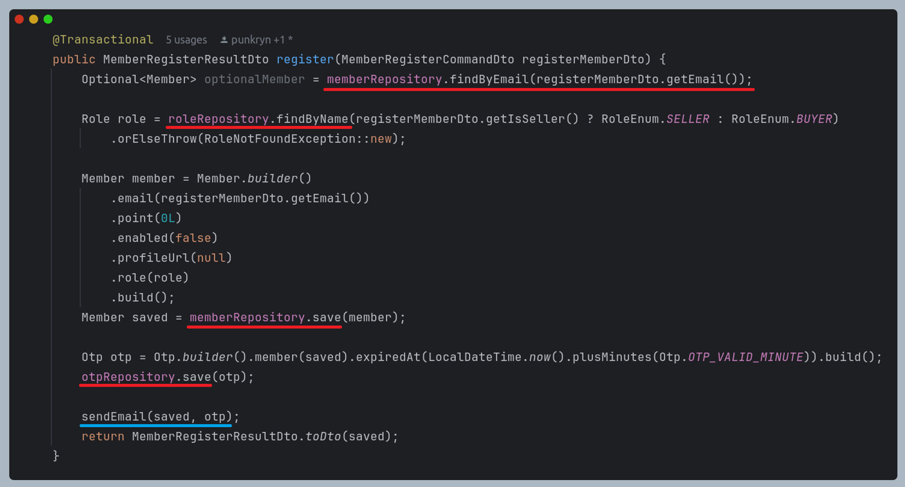
위 코드는 백엔드 서버의 회원가입 로직이다.

코드를 분석해보았을 때 빨간줄이 쳐진 부분이 대부분이고 이는 DB와 통신하는 로직이다. DB에 쌓인 데이터가 10건 미만으로 굉장히 적기 때문에 이는 병목의 원인이 되지 않을 것이다.

따라서 파란줄이 쳐진 부분인 이메일 전송 로직이 병목의 원인일 것이라 가정하였다.

이 부분에서 외부 메일 서버를 사용하고 **동기적**으로 처리하고 있기 때문에 메일 발송이 끝날 때까지 기다려야 때문에 병목이 될 것이다.

또한 기존에 동기적으로 동작하도록 작성된 테스트 코드가 제대로 동작하지 않기 때문에 비동기 처리가 되더라도 테스트를 통과할 수 있도록 테스트를 변경해야 한다.

## 해결 방안
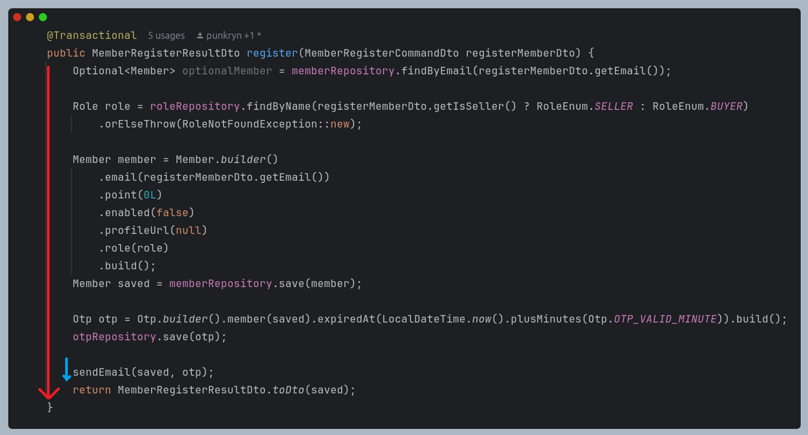
회원 가입 특성 상 이메일 전송이 완료 되기를 기다릴 필요 없이 바로 메인 페이지로 넘어가도 무방하다.

따라서 이메일 전송 로직만 **비동기적**으로 동작하게 하여 로직의 흐름을 블로킹하지 않도록 하면 문제를 해결할 수 있을 것이다.

이는 위 코드처럼 실행 흐름이 두 개로 나뉘는 것이다.

### 비동기 처리
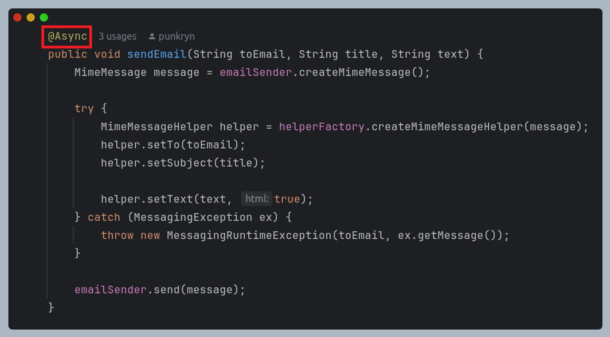
위 코드는 email 전송 로직의 일부이다.

스프링 부트에서는 위 코드처럼 `@Async` annotation을 붙이는 것으로 간단하게 비동기 처리를 할 수 있다.

### 비동기 설정

**Task Executor**

spring boot에서는 기본적으로 `SimpleAsyncTaskExecutor`를 사용한다. 해당 방식은 요청이 들어올 때마다 스레드를 만들기 때문에 서버 전체에 영향을 줄 수 있다.
따라서 트래픽이 많은 환경에서는 적합하지 않다.

우리는 트래픽이 많은 환경을 가정하고 있기 때문에 스레드를 재사용할 수 있는 스레드풀 기반의 `ThreadPoolTaskExecutor`로 변경 적용하였다.

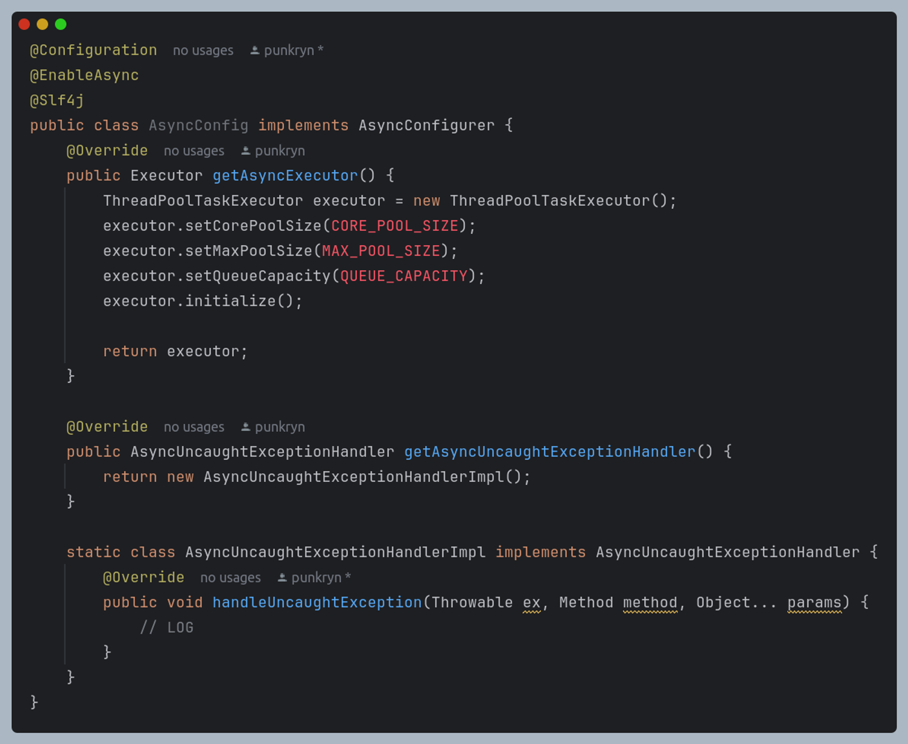
위 코드와 같이 AsyncConfigurer를 상속하여 구현한다.

스레드 개수, 큐 사이즈 등을 설정한다.

한 가지 유의할 점은 비동기 작업에서 발생하는 예외는 스프링으로 전파되지 않기 때문에 예외 처리에 대한 부분을 `getAsyncUncaughtExceptionHandler`에서 override해서 구현해야 한다.

### 테스트
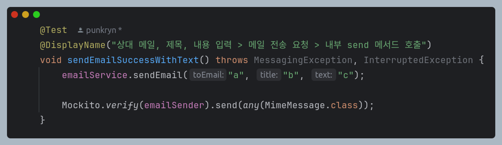
이제 위 코드처럼 동기적으로 동작하는 테스트 코드가 통과될 수 있게 변경해야 한다.

`emailService`의 `sendEmail` 내부에서 호출하는 `emailSender`의 `send` 메소드가 비동기적으로 동작하는 코드이기 때문에 현재 코드에서는 이를 테스트할 수 없는 상황이다.

왜냐하면 `send` 메소드가 호출되는지를 검증하고 있는데 비동기적으로 동작하기 때문에 실행을 기다리지 않고 코드 흐름이 넘어가버리기 때문이다.

이를 해결할 수 있는 세 가지 방법이 있다.

1. **비동기를 동기로 동작하도록 변경**
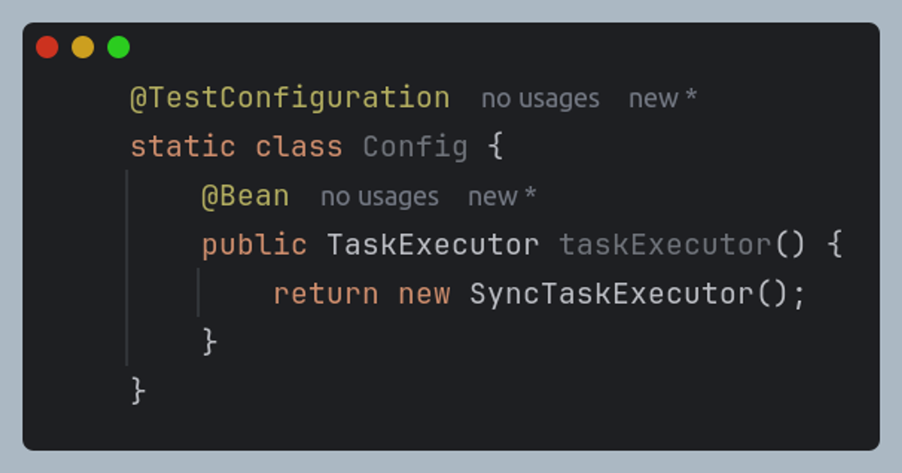  
비동기적으로 동작하는 send 메소드를 동기적으로 동작하도록 변경하는 방법이다.

테스트 하려는 클래스에 위 설정을 선언하면 비동기 코드를 동기적으로 동작하도록 할 수 있다.

이는 `SimpleAsyncTaskExecutor`, `SyncTaskExecutor` 모두 `TaskExecutor`를 상속하고 있기 때문이다.

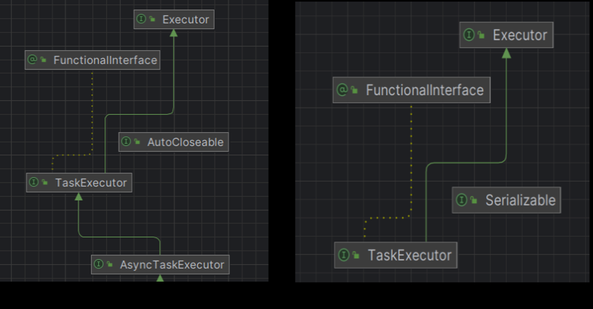
ThreadPoolExecutor를 사용할 경우 공통적으로 상속하는 인터페이스가 Executor이기 때문에 반환타입을 Executor로 수정해야한다.

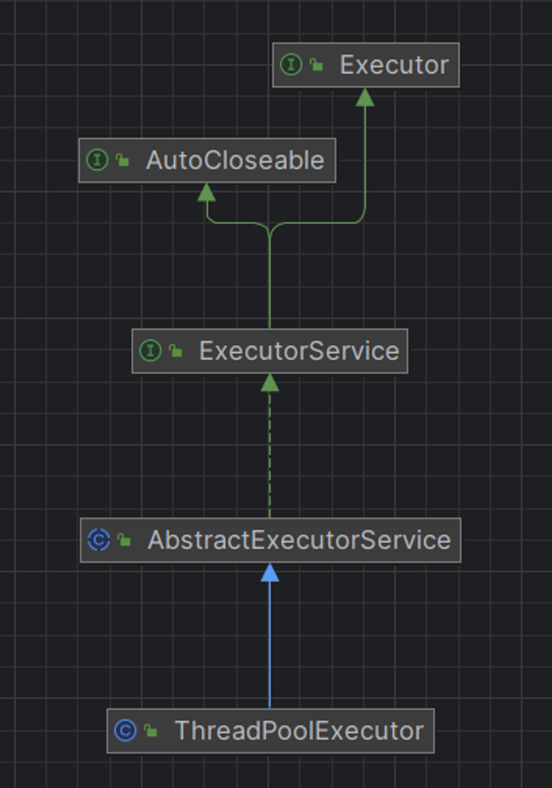
이 방법은 테스트 코드에 큰 변경 없이 쉽게 적용 가능하다는 장점이 있지만,

비동기 작업을 동기적으로 동작하도록 변경하기 때문에 어떤 사이드 이펙트가 발생할지 알 수 없다.

2. **일정시간 기다리기**
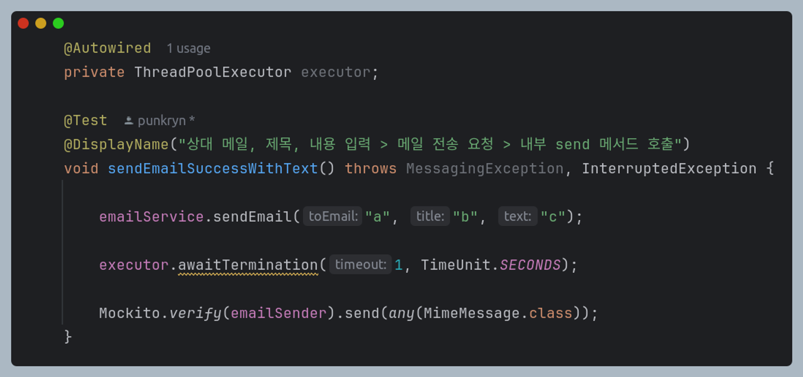
 위 방식은 스레드 풀의 모든 작업이 종료될 때까지 일정 시간 실행 흐름을 막고 모두 종료되면 안전하게 블로킹이 해제되도록 한다.

실행 환경에 따라 어느 정도 기다려야 되는지 명확하게 알 수가 없기 때문에 이 방법에 대한 우선 순위가 조금 내려갔다.

3. **CountDownLatch 적용**
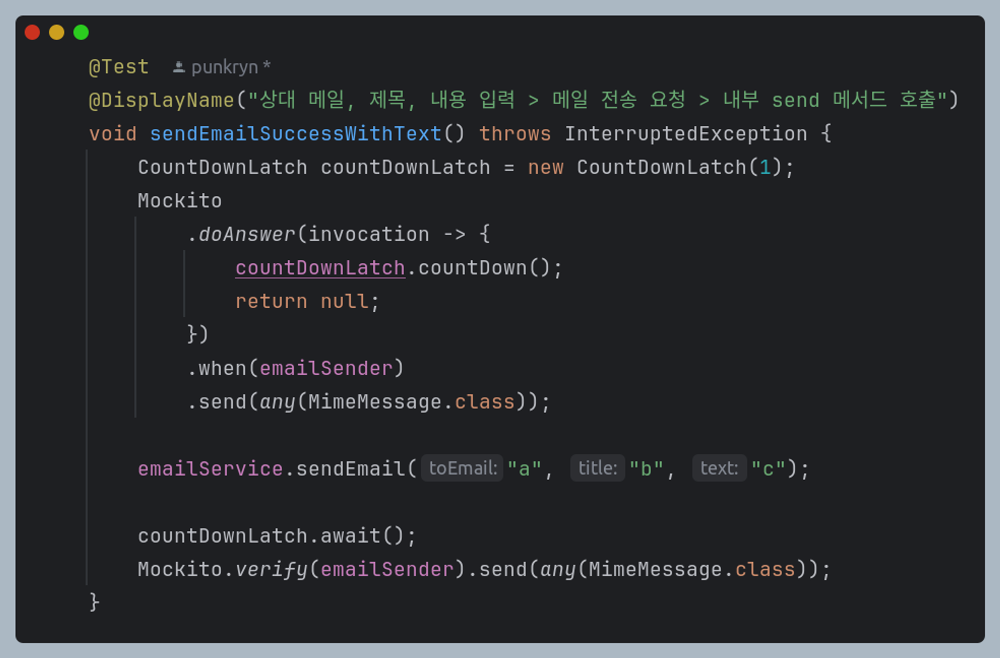
스레드간 동기화를 효과적으로 처리할 수 있는 CountDownLatch를 적용하여 비동기 작업이 완료되는 것을 기다리게 할 수 있다.

위 코드는 `send` 메소드가 실행되면 `countDown`이 실행되도록 하여 `await`가 해제되어 테스트를 검증하게끔 작성한 코드이다.

앞선 두 방식보다 우아한 방법으로 단점들을 극복한 방법이다.

단점이 있다면 코드 작성이 앞선 두 방식보다 조금 더 어렵다는 점과 반드시 모킹하거나 `@SpyBean` annotation을 붙일 수 있어야 한다는 점들이 있다.

# 결론
## 성능
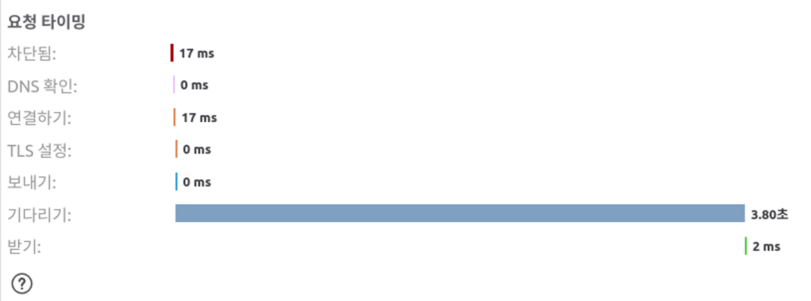
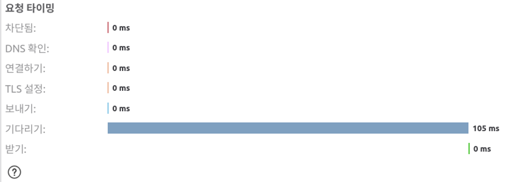

병목이었던 이메일 전송을 비동기 작업으로 전환하면서 3초 걸리던 요청이 0.1초로 줄어든 것을 확인할 수 있다.

## 테스트

비동기 테스트 세 가지 방법 중 마지막 방법을 선택하여 적용하였다.

1번 방법은 사용하지 않는 것을 권장하고 2, 3번 방법은 테스트 케이스마다 상황마다 적절하게 선택하여 적용하면 비동기 테스트에 대해서는 문제 없이 처리할 수 있다.
