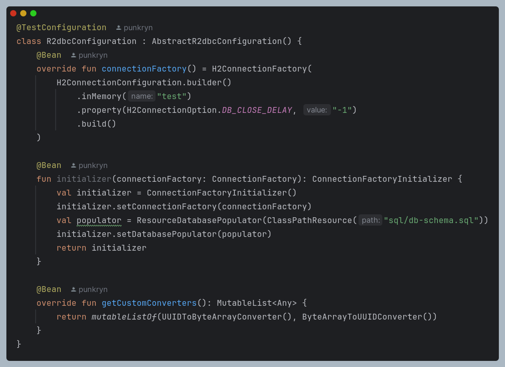
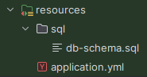
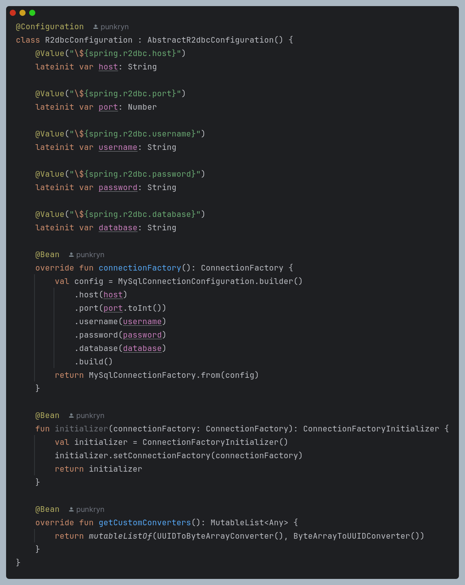
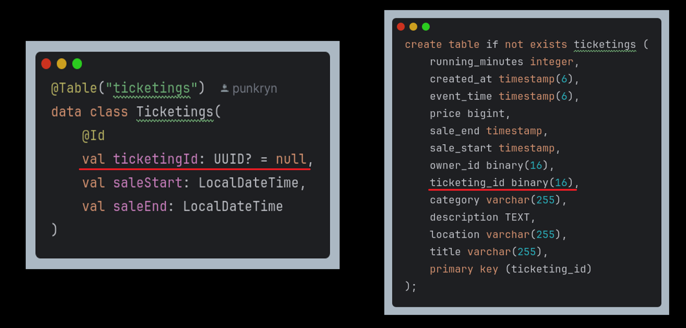
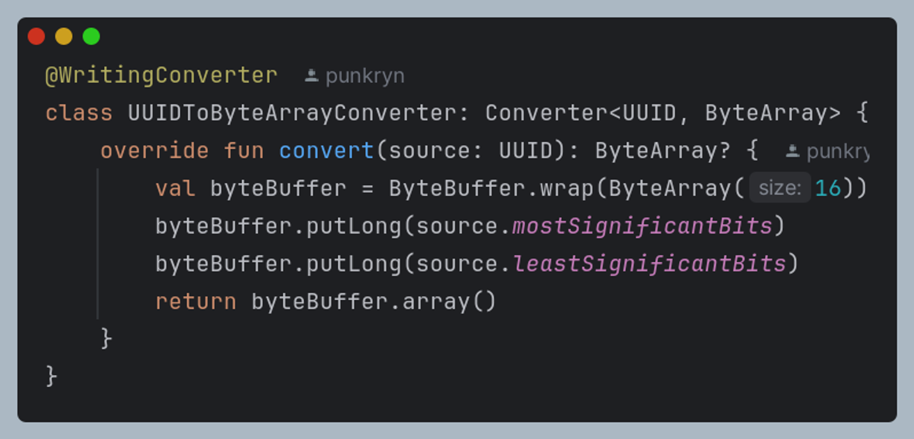
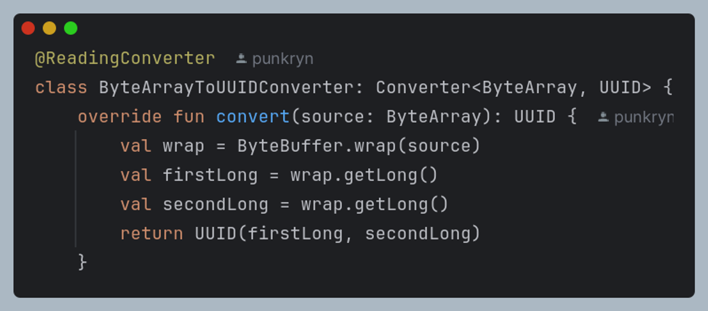
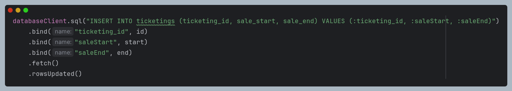

# 서론

> R2DBC is a specification designed from the ground up for reactive programming with SQL databases.
> - https://r2dbc.io/
{: .prompt-danger }

저희 팀은 대기열 서버를 구현하기 위해 WebFlux와 R2DBC를 선택하였고, 반응형 프로그래밍으로 디자인된 R2DBC와 WebFlux 서버를 연동하기 위해 해결한 문제들을 정리한 문서입니다.

WebFlux를 선택한 자세한 이유는 팀원이 작성한 해당 문서를 참고하시면 좋습니다.

[왜 Waiting 서버는 Kotlin + WebFlux인가](https://www.notion.so/Waiting-Kotlin-WebFlux-14580eb679ac45ffab4218b352f0ec38?pvs=21)

# 본론

## Configuration

설정 방법에는 두 가지가 있습니다.

첫 번째는 `application.yml` 파일을 통해 설정하면 spring boot에서 자동으로 설정 값들을 생성합니다.

두 번째 방식이 `AbstractR2dbcConfiguration`을 상속하여 직접 빈을 구현하는 방식입니다. 저는 후술할 이유에 의해서 두 번째 방법을 택하였습니다.

### Test

테스트 환경에서 동작할 설정 값들입니다.

테스트에서는 H2를 사용하기 때문에 H2와 관련하여 설정을 합니다.

주의해야할 점은 R2DBC는 ORM이 아니기 때문에 엔티티와 테이블을 매핑해주지 않는 점입니다. 즉, DDL을 생성해주지 않기 때문에 직접 DDL을 작성하고 실행 시 테이블을 만들도록 해야 합니다. 이를 위한 `poulator` 설정이 있습니다.

위 코드처럼 경로를 작성하고 이미지처럼 resources 아래에 경로대로 sql 파일을 두어야 합니다.

### Dev

개발 환경에서는 MySQL을 사용하기 때문에 MySQL Connection에 대한 설정이 필요합니다.

### Converter

테스트 환경과 개발 환경 모두 공통으로 `getCustomConverters`를 오버라이드하고 있습니다. 해당 메서드는 사용자가 정의한 컨버터를 등록하는 것입니다. 이처럼 컨버터를 등록하는 이유는 UUID 바인딩 때문입니다. 저희는 기본키로 UUID를 사용하고 있기 때문에 UUID 바인딩이 필수입니다.

`Spring Data R2DBC`는 타입에 따라서 컨버터가 동작하여 DB에 맞게 값을 변환해 바인딩하는 역할을 하는데 UUID 타입의 컨버터가 따로 없기 때문에 사용자가 정의하여 등록할 필요가 있습니다.

위 이미지처럼 UUID 타입을 binary타입으로 변환할 필요가 있습니다. 반대로 DB의 값을 읽어올 때는 binary 타입을 UUID로 변환해야 할 필요가 있습니다. 따라서 custom converter를 직접 구현하여 등록하였습니다.

### UUID → ByteArray

### ByteArray → UUID

이처럼 사용자정의 컨버터를 등록하기 위해 `getCustomConverters`를 오버라이드할 필요가 있었고 이때문에 `application.yml` 설정만으로는 한계가 있어 직접 빈을 정의하여 설정을 하였습니다.

## DatabaseClient

DB에 접근하는 방법에는 두 가지가 있습니다.

첫 번째는 JPA를 사용하듯 Repository 패턴을 사용하는 방식입니다.

두 번째는 databaseClient로 직접 SQL을 작성하는 방식입니다.

UUID 타입의 id를 자동으로 생성하는 전략이 없어 값을 insert할 때는 databaseClient를 사용하였고, 값을 검색할 때는 Repository를 사용하였습니다.

(참고로 JPA 영속성 컨텍스트처럼 id에 값을 채워서 save하면 update 쿼리가 나갑니다.)

위 이미지처럼 sql을 직접 작성하고 값을 바인딩합니다. id가 UUID지만 Converter를 등록했기 때문에 정삭적으로 동작합니다. start, end는 LocalDateTime으로 따로 컨버터를 등록하지 않아도 변환을 잘 합니다.

[Spring R2DBC Docs](https://docs.spring.io/spring-framework/reference/data-access/r2dbc.html#r2dbc-DatabaseClient-examples-update)

# 결론

JDBC를 직접 사용하면 번거로움이 많듯 R2DBC도 마찬가지로 직접 해주어야 할 것들이 있어 개발 경험이 저하됨을 느낄 수 있습니다.

따라서 이처럼 비동기, 논블로킹 I/O를 달성하기 위해 러닝커브가 상당한 WebFlux + R2DBC 조합을 사용하는 것보다 Node.JS를 사용하는 방향도 고려해보면 좋을 것으로 보입니다.

추후 동일한 기능의 Node.JS 서버도 추가적으로 구현하여 어느쪽이 더 나은지 성능을 비교하여 보도록 하겠습니다.
